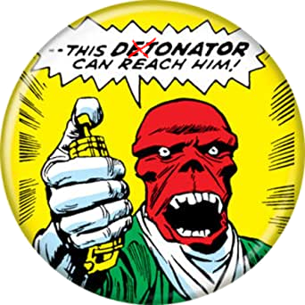

# Tocer

Every good software started with the proper testing scenario.
A proper testing scenario is only possible if you have documented requirements.

Do you want to write a better document?
Do you have too many ideas and you don't even know where to start?

You should start with TOC (Table of Content).

Tocer is a good tool to help you scaffold the entire documentation based on a simple bullet list.

Feel free to change your bullet items, add new ones, and re-generate.

Even better, you can also put some code snippets in your document.
Tocer will evaluate your code and show the output in the document.


# Try It Yourself

[](https://asciinema.org/a/QwoEhqDonbKj6eozg2qSgGyqr)

<details>
<summary>
Show the script
</summary>

```bash
echo "🐶 Preparing Demo"
mkdir -p ~/testTocerPlayground
cd ~/testTocerPlayground
cp ~/tocer/sample-template.md README.md

echo "🐶 Original README.md content:"
cat README.md

echo "🐶 Running Tocer"
python ~/tocer/tocer.py

echo "🐶 New README.md content:"
cat README.md
```
</details>

# Prerequisites

* Python

# How to install

```bash
git clone git@github.com:state-alchemists/tocer.git ${HOME}/tocer
```

# How to use

* Create a TOC file (e.g: `README.md`) containing nested bullets flanked by two HTML tags: `<!--startToc>` and `<!--endToc>`
* Run `python tocer.py <toc-file>` (e.g: `python tocer.py README.md`).

# Expected result

* Every bullet item between `<!--startToc>` and `<!--endToc>` in your TOC file will be turned into link, unless it already is.
* If the documents referred by the links does not exist, they will be created.

# Testing

* Run `test.sh`

# Donation

# ☕ Donation

Help Red Skull to click the donation button:

[](https://stalchmst.com/donation.html)


# FAQ

## I have run tocer. Can I add some items to the TOC and re-run it?

Yes, you can. `tocer` will turn your new items into links and create respective documents.

## I change existing item's position and caption and re-run tocer. Is that okay?

Yes, it is okay. `tocer` will update all `title`, `breadcrumbs`, and `subtopics` to match your new structure.

## Great job. Can I contribute?

Sure you can do:

* Create pull request
* Open issue
* Donate